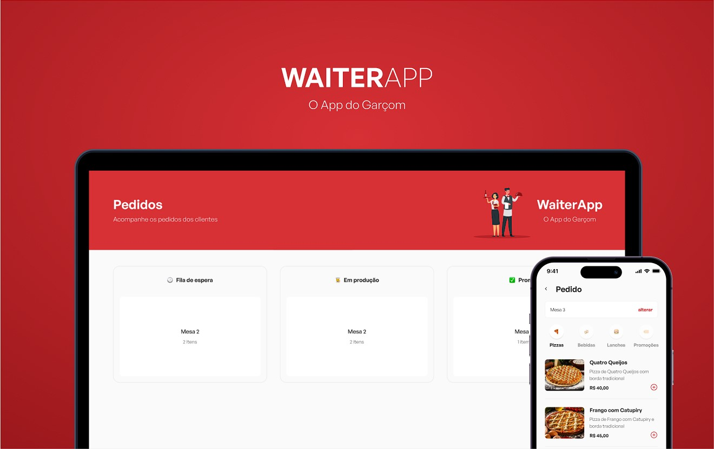

<h1 align="center"> WAITERAPP - O App do Garçom </h1>

  <a href="#-tecnologias">Tecnologias</a>&nbsp;&nbsp;&nbsp;|&nbsp;&nbsp;&nbsp;
  <a href="#-projeto">Projeto</a>&nbsp;&nbsp;&nbsp;&nbsp;&nbsp;&nbsp;</a>

 

<h2 align="center"> Preview </h2>

  

## 🚀 Tecnologias

Esse projeto foi desenvolvido com as seguintes tecnologias:

- 💻 #Web Front end :

- [TypeScript](https://www.typescriptlang.org/)
- [React](https://reactjs.org/)
- [Styled-components](https://styled-components.com)
- [Socket.IO](https://socket.io)

---

- ⚙️ #Back end :

- [Node.js](https://nodejs.org/en/)
- [Axios](https://github.com/axios/axios)
- [Express](https://expressjs.com)
- [Docker](https://www.docker.com)
- [MongoDB](https://www.mongodb.com)

---

- 📱 #Mobile :

- [React Native](https://reactnative.dev/)
- [Expo](https://expo.dev/)
- [Axios](https://github.com/axios/axios)

## 💻 Projeto

O projeto é um aplicativo para garçons, onde o mesmo pode fazer pedidos, ver o status do pedido, ver o valor total da conta e enviar para a cozinha.

#### Funcionalidades Web:

- [x] Listagem de mesas
- [x] Listagem de pedidos
- [x] Listagem de pedidos por mesa
- [x] Cancelar pedido
- [x] Finalizar pedido
- [x] Atualizar status do pedido (Fila de espera, em preparo, pronto)
- [x] Pedidos aparecem em realtime com Socket.IO

#### Funcionalidades Mobile:

- [x] Listagem de mesas
- [x] Listagem de produtos
- [x] Listagem de categorias
- [x] Listagem de produtos por categoria
- [x] Cancelar pedido
- [x] Finalizar pedido
- [x] Adicionar produto ao pedido
- [x] Remover produto do pedido
- [x] Tela de pedido realizado

---

Feito com ♥ by Gustavo Batista :wave: [LinkedIn](https://www.linkedin.com/in/gustavo-h-batista/) e [GitHub](https://github.com/gustavohdab)
